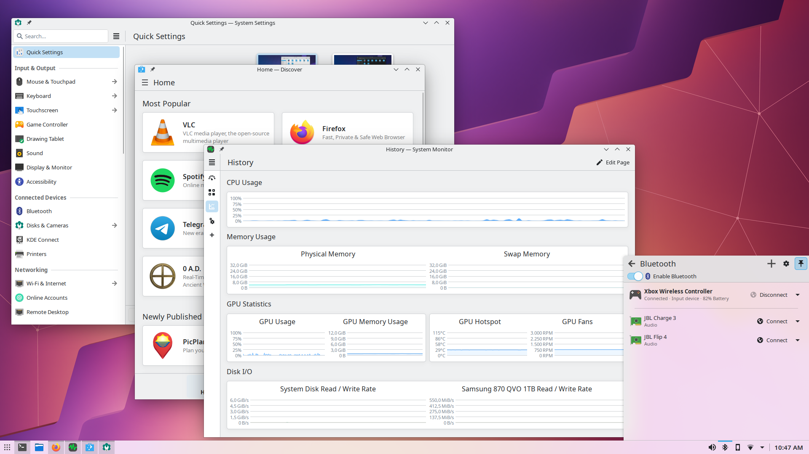

# A list of KDE components that will make your user experience even better



KDE, like all of Linux, is modular, and sometimes you need to install additional packages to get certain functionalities. Are you a long-time Arch user? Did you know you can backup your important files directly from the system settings?

This repository contains a list of official Arch Linux / AUR packages (developed by KDE team) as well as third-party applications and plugins that add or enhance KDE’s functionality. You can also check out the repository’s Wiki page, where you might find useful information.

This repository is **not** a guide for installing KDE Plasma on Arch Linux, **nor** is it a beginner’s manual (well, except for the Wiki, perhaps). Additionally, it aims to avoid packages that are automatically installed along with the `plasma` package group, the `plasma-desktop` meta-package, and others. More details about this are provided [here](https://wiki.archlinux.org/title/Meta_package_and_package_group).

If you don’t want to worry about selecting the right components and want a complete, ready-to-use desktop environment immediately, you can run this command to get every KDE package group (jq required):

```bash
curl -s https://archlinux.org/groups/ | grep -oP 'kde-[^/"]+|kf[5,6]|kdevelop' | sed 's/<$//' | jq -R . | sed 's/\"//g' | uniq
```

Running this command will give you a list of all KDE Plasma package groups you want to install.

#### Contributing

If you’d like to contribute to the development of this repository, feel free to open an issue or pull request explaining why the component you’ve chosen should be included in this list.

#### Support

If you’d like to show your appreciation, leave a star on this repository and follow me on GitHub.  
If you’d like to support me financially, please open an issue.

## Core Components

A list of KDE components that work invisibly to the user, but do important work, **extending** the functionality of DE.

- `kf6` <sup>(package group)</sup> - important packages for building packages, generating documentation, and more
- [svgpart](https://apps.kde.org/svgpart) - allows some KDE apps to render svg images without third-party tools
- [markdownpart](https://apps.kde.org/markdownpart) - allows some KDE applications to render markdown without third-party tools
- [kde-inotify-survey](https://github.com/KDE/kde-inotify-survey) - diagnostic tool to check inotify limits ([screenshot](https://raw.githubusercontent.com/KDE/kde-inotify-survey/refs/heads/master/screenshot.png), [wikipedia](https://en.wikipedia.org/wiki/Inotify))
- [flatpak-kcm](https://kde.org/plasma-desktop) -  system settings module for controlling flatpak apps
- [kdenetwork-filesharing](https://apps.kde.org/kdenetwork_filesharing) - provides easy file sharing over the network. *Note: still in development*
- [kio-extras](https://github.com/KDE/kio-extras) - additional components to increase the functionality of KIO
- [kio-fuse](https://github.com/KDE/kio-fuse) - allows you to mount remote directories
- [kio-gdrive](https://apps.kde.org/kio_gdrive) - allows you to connect to cloud storage
- [kio-admin](https://github.com/KDE/kio-admin) - allows you manage files as administrator
- [xwaylandvideobridge](https://github.com/KDE/xwaylandvideobridge) - utility to stream Wayland windows to X apps
- [iio-sensor-proxy](https://gitlab.freedesktop.org/hadess/iio-sensor-proxy) - automatic screen rotation
- [maliit-keyboard](https://maliit.github.io) - on-screen keyboard
- [power-profiles-daemon](https://gitlab.freedesktop.org/upower/power-profiles-daemon) - enables the power management in Plasma. Please read the note below. Don't use alongside [tuned](https://github.com/redhat-performance/tuned)
- [tuned](https://github.com/redhat-performance/tuned) & [tuned-ppd](https://github.com/redhat-performance/tuned) - enables the power management in Plasma. Please read the note below. Don't use alongside [power-profiles-daemon](https://gitlab.freedesktop.org/upower/power-profiles-daemon)
- [orca](https://userbase.kde.org/Accessibility/Plasma#Starting_Orca_Screenreader) - screen reader
- [cryfs](https://www.cryfs.org), ~~[encfs](https://github.com/vgough/encfs)~~ <sup>(deprecated)</sup>, [gocryptfs](https://github.com/rfjakob/gocryptfs) - pseudo / virtual filesystems for Plasma Vault
- [ufw](https://git.launchpad.net/ufw) - firewall daemon. Don't use alongside firewalld
- [firewalld](https://github.com/firewalld/firewalld) - firewall daemon. Don't use alongside ufw
- [fwupd](https://github.com/fwupd/fwupd) - provides ability to update PC firmware from Discover
- [quota-tools](https://sourceforge.net/projects/linuxquota) - applet for [Disk Quota](https://en.wikipedia.org/wiki/Disk_quota). You don't need this, trust me
- [ripgrep{-all}](https://github.com/BurntSushi/ripgrep) - Dolphin's search backend <sup>[`blog`](https://blogs.kde.org/2024/10/02/use-ripgrep-all-/-ripgrep-to-improve-search-in-dolphin)</sup> when baloo is off
- [hunspell-<language-code>](https://github.com/hunspell/hunspell) - spell cheking and dictionaries
- [krfb](https://apps.kde.org/krfb) - remote desktop support
- [symmy-git](https://invent.kde.org/utilities/symmy) - encrypt and decrypt local files from Dolphin's context menu. *Probably* deprecated. AUR only. Note: `kf6` required to build the package
- [kdeconnect](https://kdeconnect.kde.org) - seamlessly integrates your phone and devices with Plasma
    - `sshfs` - allows to browse phone's filesystem
    - `qt6-tools` - runcommand plugin settings
    - `krfb` - use remote device as virtual monitor
- [kcm-grub2-git](https://invent.kde.org/system/kcm-grub2) - configure and manage the GRUB bootloader in Plasma. Note: `packagekit-qt6` is required! 
- [kcron](https://apps.kde.org/kcron) - configure and schedule cron tasks
- [kwalletmanager](https://apps.kde.org/nl/kwalletmanager5) - kwallet KCM module
- [kup](https://invent.kde.org/system/kup) - manage backups in System Settings
    - `bup` - git packfile support
    - `rsync` - you know what it is
- [dolphin-plugins](https://apps.kde.org/dolphin_plugins) - provides a variety of useful plugins for Dolphin, including ISO mounting
- [system-config-printer](https://archlinux.org/packages/extra/x86_64/system-config-printer/) - cups interface for system settings
- [keditbookmarks](https://github.com/KDE/keditbookmarks) - adds ability to edit bookmarks in some KDE apps
- [colord-kde](https://invent.kde.org/swiftloke/colord-kde) - color management & KCM module
- [audex](https://apps.kde.org/audex) - multimedia KCM module
    - `faac` - MP4/M4A/AAC encoder
    - `flac` - FLAC encoder
    - `lame` - MP3 encoder
    - `vorbis-tools` - OGG encoder
    - `opus-tools` - OPUS encoder

### Thumbnail Generation / Thumbnail Engines

- [ffmpegthumbs](https://github.com/KDE/ffmpegthumbs) - video files thumbnails across KDE apps
- [kdegraphics-thumbnailers](https://apps.kde.org/kdegraphics_thumbnailers) - PostScript, RAW, Mobipocket y Blender projects previews
- `kdegraphics-mobipocket` - a collection of plugins to handle mobipocket files. There is no clear description available
- [kimageformats](https://api.kde.org/frameworks/kimageformats/html/index.html) - a KDE library adding support for various image formats, enabling viewing and processing in KDE apps. More info [here](https://api.kde.org/frameworks/kimageformats/html/index.html)
- [icoutils](https://www.nongnu.org/icoutils) - thumbnails for Windows executables inside KDE apps. Note: not all `*.exe` support thumbnail preview
- [qt6-imageformats](https://doc.qt.io/qt-6/qtimageformats-index.html) - supports formats like `.png`, `.jpeg`, `.gif` and more

> [!WARNING]
>
> To make power management available in KDE, enable corresponding systemd service:
> 
> ```bash
> systemctl enable --now <tuned tuned-ppd \| power-profiles-daemon>
> ```
> 
> As well as firewall daemon:
> ```bash
> systemctl enable --now <ufw \| firewalld>
> ```


## KDE PIM 

**Note**: All of the packages listed below are supported by the KDE team.

[KDE](https://community.kde.org/KDE_PIM) [PIM](https://en.wikipedia.org/wiki/Personal_information_manager) (Personal Information Manager) helps manage personal data like contacts, phone numbers, addresses, emails, and more. If you haven't missed it, you probably don't need it.

To install the entire set of required programs at once, use the `kde-pim` package group, or the `kde-pim-meta` meta package.

- [kontact](https://apps.kde.org/kontact) - email, calendar, contacts and other personal data management
- [kmail](https://apps.kde.org/kmail2) - mail client
- [korganizer](https://apps.kde.org/korganizer) - ersonal calender, tasks management and more
- [kaddressbook](https://apps.kde.org/kaddressbook) - personal data such as family members, friends, phone number and much more
- [akregator](https://apps.kde.org/akregator) - [RSS](https://en.wikipedia.org/wiki/RSS) reader
- [zanshin](https://apps.kde.org/zanshin) - day to day actions management
- [ktimetracker](https://apps.kde.org/ktimetracker) - time management. Not part of PIM, but included here anyway
- [kleopatra](https://apps.kde.org/kleopatra) - certificate management
- [kmymoney](https://apps.kde.org/kmymoney) - self-explanatory
- [kdepim-addons](https://github.com/KDE/kdepim-addons) - a set of PIM plugins
- [kwalletmanager](https://apps.kde.org/kwalletmanager5) - password manager

For detailed further instructions, please refer to [ArchWiki](https://wiki.archlinux.org/title/KDE#PIM).

## System Administration / Monitoring

- [filelight](https://apps.kde.org/filelight) -  disk usage visualizer
- [isoimagewriter](https://apps.kde.org/isoimagewriter) - disk image writer. Also try [Ventoy](https://github.com/ventoy/Ventoy)
- [kdf](https://apps.kde.org/kdf) (kdiskfree) - view disk usage
- [kfind](https://apps.kde.org/kfind) - simple but fast file searching
    - `mlocate` - search using mlocate index <sup>(AUR only)</sup>
- [kgpg](https://apps.kde.org/kgpg) - GUI application for GPG management
- [kjournald](https://invent.kde.org/system/kjournald) - view and manage [journalctl](https://www.freedesktop.org/software/systemd/man/journalctl.html) logs
- [ksystemlog](https://apps.kde.org/ksystemlog) - view and manage kernel, Xorg, and other system logs
- [krusader](https://apps.kde.org/krusader) - twin-pannel file manager
    - `keditbookmarks` - bookmarks management
    - `kde-cli-tools` - file associations & root mode
    - `kdiff3` - file contents comparison
    - `krename` - advanced file rename
    - `konsolepart` - terminal support
    - `ktexteditor` - file editing support
- [partitionmanager](https://apps.kde.org/partitionmanager) - *"[GParted](https://gparted.org) by KDE"*
    - *Opt deps*: the same as opt deps for GParted (`pacman -Si gparted`)
- [sweeper](https://apps.kde.org/sweeper) - cache cleaner
- [systemdgenie](https://invent.kde.org/system/systemdgenie) - control systemd services from GUI frontend
- [yakuake](https://apps.kde.org/yakuake) - drop-down terminal

## Multimedia

- [amarok](https://apps.kde.org/amarok) - music player
- [audiotube](https://apps.kde.org/audiotube) - YouTube music player
- [kaffeine](https://apps.kde.org/kaffeine) - media player
- [dragon](https://apps.kde.org/dragonplayer) - media player
- [elisa](https://apps.kde.org/elisa) - music player, supports radio streaming
- [haruna](https://apps.kde.org/haruna) - [mpv](https://mpv.io) on steroids
    - `yt-dlp` - YouTube streaming support
- [juk](https://apps.kde.org/juk) - music player
- [kid3](https://apps.kde.org/kid3) - audio tag editor
- [kget](https://apps.kde.org/kget) - universal download manager
    - `libktorrent` - torrent support
- [ktorrent](https://apps.kde.org/ktorrent) - torrent client
    - `kplotting` - statistics plugin for KTorrent
- [plasmatube](https://apps.kde.org/plasmatube) - YouTube frontend
- [vvave](https://apps.kde.org/vvave) - music player

## Office

- [arianna](https://apps.kde.org/arianna) - simple ebook reader
- [calligra](https://apps.kde.org/calligra) - all-in-one office suite
    - `libetonyek` - Apple Keynote import filter
    - `libvisio` - Microsoft Visio import filter
    - `libwpg` - Corel WordPerfect Graphics image importer
    - `libwps` - Microsoft Works file importer
    - `poppler` - PDF to SVG filter
    - `pstoedit` - EPS to SVG filter
    - `qt6-webengine` - Braindump web shape
- [francis](https://apps.kde.org/francis) - pomodoro timer
- [ghostwriter](https://apps.kde.org/ghostwriter) - markdown editor / note-taking app
    - `cmark` - [CommonMark](https://commonmark.org) support
    - `mathjax` - [MathJax](https://www.mathjax.org) rendering in live preview
    - `pandoc` - [Pandoc](https://github.com/jgm/pandoc) support
- [marknote](https://invent.kde.org/office/marknote) - markdown editor / note-taking app
- [gwenview](https://apps.kde.org/gwenview) - fast image viewer with editing features
    - `kamera` - import images from cameras
    - `kimageformats` - mentioned above
    - `qt6-imageformats` - mentioned above
- [kalk](https://apps.kde.org/kalk) - calculator
- [kcalc](https://apps.kde.org/kcalc) - calculator
- [kcolorchooser](https://apps.kde.org/kcolorchooser) - simple color picker
- [karp](https://apps.kde.org/karp) - PDF editor. *Note*: still in development
- [kdenlive](https://apps.kde.org/kdenlive) - powerful video editor
    - `bigsh0t` - VR360 effects
    - `dvgrab` - firewire capture
    - `kimageformats` - mentioned above
    - `mediainfo` - technical clip information
    - `noise-suppression-for-voice` - self-explanatory
    - `opencv` - motion tracking
    - `opentimelineio` - timeline import & export
    - `python-openai-whisper` & `python-srt_equalizer` - OpenAI's stt model
    - `python-vosk` - VOSK stt model
    - `recordmydesktop` - screen capture
- [kile](https://apps.kde.org/kile) - LaTex editor
- [klevernotes](https://apps.kde.org/klevernotes) - note-taking app
- [kolourpaint](https://apps.kde.org/kolourpaint) - simple paint app, similar to "Paint" in Windows
- [kphotoalbum](https://apps.kde.org/kphotoalbum) - photo management tool (tags, collections, and more)
- [okular](https://apps.kde.org/okular) - PDF reader on steroids
    - `ebook-tools` - mobi and epub support
    - `unarchiver` or `unrar` - Comic Book support
- [subtitlecomposer](https://apps.kde.org/subtitlecomposer) - subtitle editor

## Programming

- [kommit](https://apps.kde.org/kommit) - git GUI frontend
- [kate](https://apps.kde.org/kate) - advanced text editor
    - `clang` - C & C++ LSP support
    - `git` - git-blame support
    - `python-lsp-server` - self-explanatory
    - `qt6-declarative` - RBQL plugin
    - `qtkeychain-qt6` - SQL plugin
    - `rust` - rust LSP support
    - `texlab` - LaTeX support
- [kdevelop](https://apps.kde.org/kdevelop) - IDE
    - `apr`, `apr-util`, `subversion` - SVN support
    - `gdb` - GNU debugger
    - `heaptrack` - memory profiler
    - `cppcheck` - code analyzer
    - `meson` - meson integration
    - `purpose` - patch review plugin
    - `qt6-doc` - QT documentation integration
- [kompare](https://apps.kde.org/kompare) - diff / patch frontend
- [okteta](https://apps.kde.org/okteta) - HEX editor

## Misc

- [alpaka](https://apps.kde.org/alpaka) — GUI frontend for [Ollama](https://ollama.com). *Note*: still in development
- [kcharselect](https://apps.kde.org/kcharselect) — unicode character picker
- [kclock](https://apps.kde.org/kclock) — simple clock app for KDE Plasma / Plasma Mobile
- [kmousetool](https://apps.kde.org/kmousetool) — mouse auto clicker
- [kweather](https://apps.kde.org/kweather) — weather app for KDE Plasma / Plasma Mobile
- [nota](https://apps.kde.org/nota) — simple text editor for KDE Plasma / Plasma Mobile
- [kdialog](https://develop.kde.org/docs/administration/kdialog) — [zenity](https://en.wikipedia.org/wiki/Zenity) and [yad](https://github.com/v1cont/yad) alternative
- [khelpcenter](https://apps.kde.org/khelpcenter) — offline (F1 shortcut by default) documentation for KDE apps
- [optiimage](https://apps.kde.org/optiimage) — image compressor

## Third party applications

### Plasma components

- [plasma6-applets-fokus](https://gitlab.com/divinae/focus-plasmoid) — pomodoro timer plasmoid
- [plasma6-applets-panel-colorizer](https://github.com/luisbocanegra/plasma-panel-colorizer) — customize your panel as you want
- [plasma6-applets-wallpaper-effects](https://github.com/luisbocanegra/plasma-wallpaper-effects) — various wallpaper effects
- [plasma6-applets-panon](https://github.com/rbn42/panon) — an audio visualizer widget
- [plasma6-wallpapers-blurredwallpaper](https://github.com/bouteillerAlan/blurredwallpaper) — blurs wallpaper when active window is present
- [plasma6-wallpapers-wallpaper-engine-git](https://github.com/catsout/wallpaper-engine-kde-plugin) — Wallpaper Engine plugin for KDE Plasma
- [plasma6-applets-weather-widget-3-git](https://github.com/blackadderkate/weather-widget-2) — simple weather widget that live in the taskbar / tray
- [plasma6-kde_controlcentre](https://github.com/Prayag2/kde_controlcentre) — MacOS-like control center for KDE
- [kde-shader-wallaper](https://github.com/y4my4my4m/kde-shader-wallpaper/tree/plasma6) <sup>(no AUR packages)</sup> — self-explanatory. This is worth your look
- [kde-material-you-colors](https://github.com/luisbocanegra/kde-material-you-colors) — Material Design 3 color palette generator for KDE
- [kando-bin](https://github.com/kando-menu/kando) — a nice looking cross-platform pie menu
- [kwin-effect-rounded-corners-git](https://github.com/matinlotfali/KDE-Rounded-Corners) — rounded window corners with outlines and shadow interpolation
- [kwin-effects-forceblur](https://github.com/taj-ny/kwin-effects-forceblur) — self-explanatory
- [kwin-effects-kinetic](https://github.com/gurrgur/kwin-effects-kinetic) — kinetic kwin effects
- [kwin4_effect_geometry_change](https://github.com/peterfajdiga/kwin4_effect_geometry_change) <sup>(no AUR packages)</sup> — animations for windows moved or resized by programs
- [kwin-scripts-krohnkite-git](https://github.com/anametologin/krohnkite) — a dynamic tiling extension for KWin 
- [kwin-scripts-mudeer](https://github.com/darkstego/Mudeer) — virtual screen splitting
- [kwin-polonium](https://github.com/zeroxoneafour/polonium) — a tiling window manager for Plasma 6
- [chatgpt-plasmoid](https://github.com/dark-eye/com.darkeye.chatGPT) <sup>(no AUR packages)</sup> — ChatGPT plasmoid
- [ditto-menu](https://github.com/adhec/dittoMenuKDE) <sup>(no AUR packages)</sup> — Windows 11-like application launcher
- [krunner-translator](https://github.com/rizutazu/krunner-translator) <sup>(no AUR packages)</sup> — Google Translate plugin for krunner
- [fancytasks](https://github.com/alexankitty/FancyTasks) — Plasma's "Icons-Only Task Manager" on steroids. Note: not available for Plasma 6
- [ollama-control](https://github.com/imoize/plasmoid-ollamacontrol) <sup>(no AUR packages)</sup> — control ollama models from the taskbar
- [chat-qt](https://github.com/DenysMb/ChatQT-Plasmoid) <sup>(no AUR packages)</sup> — ollama chat plasmoid
- [plasmoid-dockio](https://github.com/imoize/plasmoid-dockio) <sup>(no AUR packages)</sup> — docker containers management
- [kwin-gestures](https://github.com/taj-ny/kwin-gestures) — custom kwin touchpad gestures for Plasma 6
- [kde-thumbnailer-apk](https://github.com/z3ntu/kde-thumbnailer-apk) — you got it right; Android's .apk thumbnails
- [klassy](https://github.com/paulmcauley/klassy) — custom window decoration, application style and global theme
- [darkly](https://github.com/Bali10050/Darkly) — a modern style for qt applications 

### Administration

- [kdiskmark](https://github.com/JonMagon/KDiskMark) - [CrystalDiskMark](https://sourceforge.net/projects/crystaldiskmark) alternative for Linux
- [bleachbit](https://github.com/bleachbit/bleachbit) - powerful cache cleaner
- [konsave](https://github.com/Prayag2/konsave) - backup tool designed for KDE Plasma
- [apdatifier](https://github.com/exequtic/apdatifier) <sup>(no arch packages)</sup> - applet for managing Arch Linux updates (including AUR)
    - *Depends on*: `pacman-contrib` `curl` `jq` `unzip` `tar` `fzf`
- [plasma6-applets-arch-update-notifier](https://github.com/bouteillerAlan/archupdate) - yet another one applet for managing Arch Linux updates
- [qpwgraph](https://gitlab.freedesktop.org/rncbc/qpwgraph) - PipeWire GUI frontend
- [jamesdsp](https://github.com/Audio4Linux/JDSP4Linux) - EasyEffects alternative

### Office

- [qtpass](https://github.com/IJHack/QtPass) - multi-platform GUI for pass, the standard unix password manager
- [qownnotes](https://www.qownnotes.org) - plain-text file markdown note-taking with Nextcloud / ownCloud integration
- [keepassxc](https://keepassxc.org) - cross-platform password manager

### Other

- [koi](https://github.com/baduhai/Koi) - auto light / dark mode switcher
- [yin-yang](https://github.com/oskarsh/Yin-Yang) - auto light / dark mode switcher
- [protonup-qt](https://github.com/DavidoTek/ProtonUp-Qt) - install and manage [GE-Proton](https://github.com/GloriousEggroll/proton-ge-custom), [Steam Proton](<https://en.wikipedia.org/wiki/Proton_(software)>), [Lutris](https://github.com/lutris/lutris) runners and much more
- [qbittorrent](https://github.com/qbittorrent/qBittorrent) - you know what is this!
- [media-downloader](https://github.com/mhogomchungu/media-downloader) - a cross-platform app for downloading media from a popular sites
- [mpris-discord-rpc](https://github.com/patryk-ku/mpris-discord-rpc) - self-explanatory. Not a KDE component nor made for KDE, but can integrate well with Haruna, Dragon, mpv and more, providing functional Discord RPC interface
- [papirus-folders](https://github.com/PapirusDevelopmentTeam/papirus-folders) - custom folder color for Papirus icon theme. Also check [this](https://github.com/shvedes/awesome-kde/wiki/Make-your-folders-even-more-organized)
