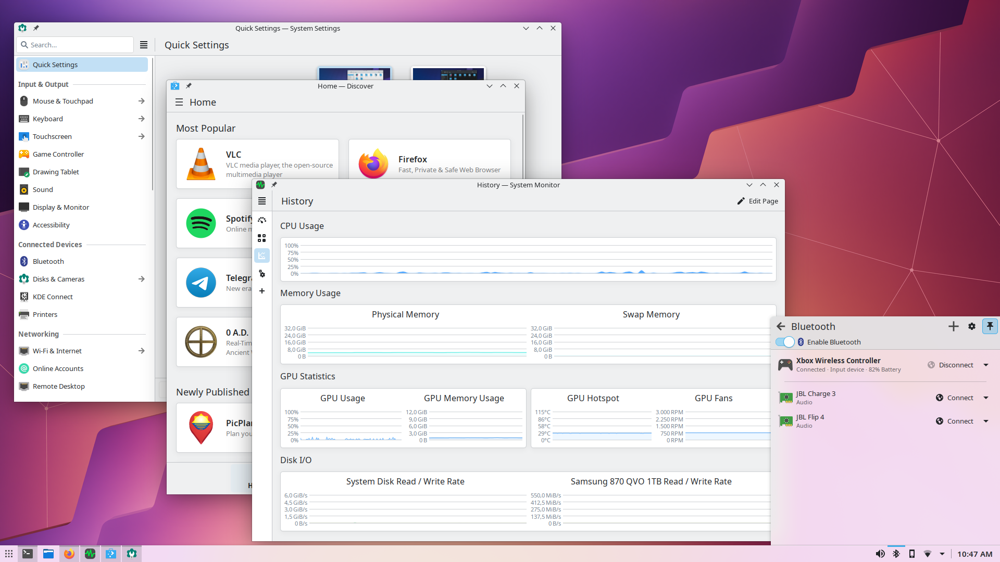

# A list of KDE components that will make your user experience even better



KDE, like all of Linux, is modular, and sometimes you need to install additional packages to get certain functionality. Are you a long-time Arch user and think you know everything? Did you know that you can backup your important files directly from the system settings?

This repository contains a list of official Arch Linux / AUR packages (developed by the KDE team) as well as third-party applications and plugins that add or enhance KDE’s functionality. You can also check out the repository’s Wiki page, where you might find useful information.

The list will be divided into several parts. The first part will list both the GUI applications that come out of the box in many distributions and the applications that are officially supported by KDE Plasma developers (see apps.kde.org). The second part will contain components, libraries, extensions, and other components that work under the hood but are important for the environment to function (for example, some packages can add certain functionality to the standard set of applications; i.e., Dolphin can natively mount ISO images). The third part will be dedicated to community work - GUI applications, compositor effects, theme engines, and so on.

If you don’t want to worry about selecting the right components and want a complete, ready-to-use desktop environment immediately, you can run this command to get every KDE package group ([`jq`](https://github.com/jqlang/jq) is required):

```bash
curl -s https://archlinux.org/groups/ | grep -oP 'kde-[^/"]+|kf[5,6]|kdevelop' | sed 's/<$//' | jq -R . | sed 's/\"//g' | uniq
```

Running this command will give you a list of all KDE Plasma package groups you want to install.

> [!NOTE]
> **Legend:** `[AUR]` - AUR-only package · `[WIP]` - in development · `[N/A]` - no packages available · `[soon]` - not yet released · `[group]` - package group · `[Mobile]` - Plasma Mobile

#### Contributing

If you’d like to contribute to the development of this repository, feel free to open an issue or pull request.

#### Credits

If you find this repo useful, you might want to see the work of these people as well:

- [francoism90/awesome-kde](https://github.com/francoism90/awesome-kde) (my inspiration)
- [shalva97/kde-configuration-files](https://github.com/shalva97/kde-configuration-files)

---

### Plasma Desktop

#### System

- `plasma-login-manager` [🔗](https://invent.kde.org/plasma/plasma-login-manager) - the new generation SDDM replacement
- `dolphin` [🔗](https://apps.kde.org/dolphin/) - the best file manager in the world
- `konsole` [🔗](https://apps.kde.org/konsole/) - the best terminal emulator in the world
- `yakuake` [🔗](https://apps.kde.org/yakuake/) - drop-down terminal
- `systemmonitor` [🔗](https://apps.kde.org/plasma-systemmonitor/) - Plasma's built-in system / resources monitor
- `discover` [🔗](https://apps.kde.org/discover/) - Plasma's built-in app store. Mostly useful on Arch only if you use Flatpaks
- `kwalletmanager` [🔗](https://apps.kde.org/kwalletmanager5/) - password & secrets manager
- `kdf` (kdiskfree) [🔗](https://apps.kde.org/kdf/) - disk usage statistics. Also provides KCM module for System Settings
- `ksystemlog` [🔗](https://apps.kde.org/ksystemlog/) - system log viewer
- `khelpcenter` [🔗](https://apps.kde.org/khelpcenter/) - basically the entire Plasma wiki, but offline
- `systemdgenie` [🔗](https://apps.kde.org/systemdgenie/) - [systemd](https://en.wikipedia.org/wiki/Systemd) management tool
- `kjournald` [🔗](https://apps.kde.org/kjournaldbrowser/) - system journal management tool
- `spectacle` [🔗](https://github.com/KDE/spectacle) - built-in screenshot / video capture utility
- `qmlkonsole` `[Mobile]` [🔗](https://apps.kde.org/qmlkonsole/) - terminal emulator designed for Plasma Mobile
- `index-fm` `[Mobile]` [🔗](https://apps.kde.org/index-fm/) - file manager for Plasma Mobile

#### Utilities

- `kbackup` [🔗](https://apps.kde.org/kbackup/) - self-explanatory
- `ark` [🔗](https://apps.kde.org/ark/) - archive manager
- `filelight` [🔗](https://apps.kde.org/filelight/) - disk usage statistics
- `kcalc` [🔗](https://apps.kde.org/kcalc/) - a simple but powerful calculator
- `kfind` [🔗](https://apps.kde.org/kfind/) - the best file search tool out there
- `kcharselect` [🔗](https://apps.kde.org/kcharselect/) - unicode character selector
- `kgpg` [🔗](https://apps.kde.org/kgpg/) - GPG management tool
- `kleopatra` [🔗](https://apps.kde.org/kleopatra/) - certificate, cryptography & GPG management tool. The author finds it quite useful
- `sweeper` [🔗](https://apps.kde.org/sweeper/) - system cleaner
- `kmag` [🔗](https://apps.kde.org/kmag/) - screen magnifier (X11 only; Wayland has this built into the compositor)
- `kweather` [🔗](https://apps.kde.org/kweather/) - weather app
- `kclock` [🔗](https://apps.kde.org/kclock/) - clock, stopwatch, timers and alarms
- `kmousetool` [🔗](https://apps.kde.org/kmousetool/) - mouse clicker
- `krecorder` `[Mobile]` [🔗](https://apps.kde.org/krecorder/) - simple voice recorder for KDE Plasma & Plasma Mobile
- `keysmith` `[Mobile]` [🔗](https://apps.kde.org/keysmith/) - 2FA code generator for KDE Plasma & Plasma Mobile
- `partitionmanager` [🔗](https://apps.kde.org/partitionmanager/) - GParted on steroids
- `isoimagewriter` [🔗](https://apps.kde.org/isoimagewriter/) - ISO burning tool
- `kate` [🔗](https://apps.kde.org/kate/) - advanced code and/or text editor
- `okteta` [🔗](https://apps.kde.org/okteta/) - advanced HEX editor
- `krename` [🔗](https://apps.kde.org/krename/) - batch file renamer
- `krusader` [🔗](https://apps.kde.org/krusader/) - file manager
- `smb4k` `[WIP]` [🔗](https://apps.kde.org/smb4k/) - advanced SAMBA explorer
- `kfloppy` [🔗](https://apps.kde.org/kfloppy/) - floppy disk formatter
- `nota` `[AUR]` `[Mobile]` [🔗](https://apps.kde.org/nota/) - simple text editor designed for KDE Plasma & Plasma Mobile
- `nota-git` `[AUR]` [🔗](https://apps.kde.org/nota/) - simple text editor designed for KDE Plasma & Plasma Mobile
- `karp-git` `[AUR]` `[WIP]` [🔗](https://apps.kde.org/karp/) - PDF arranger
- `hash-o-matic` [🔗](https://apps.kde.org/hashomatic/) - file hash verifier
- `alpaka-git` `[AUR]` `[WIP]` [🔗](https://apps.kde.org/alpaka/) - [Ollama](https://github.com/ollama/ollama) client
- `k3b` [🔗](https://apps.kde.org/k3b/) - disc burning tool
- `qrca` [🔗](https://apps.kde.org/qrca/) - barcode scanner. Also lets you share WiFi passwords via QR code
- `kdeconnect` [🔗](https://apps.kde.org/kdeconnect/) - Apple-like magic in terms of phone integration / synchronization
- `krdc` [🔗](https://apps.kde.org/krdc/) - remote desktop client
- `krfb` [🔗](https://apps.kde.org/krfb/) - remote desktop client (VNC)
- `kontrast` [🔗](https://apps.kde.org/kontrast/) - color contrast checker
- `kdialog` [🔗](https://develop.kde.org/docs/administration/kdialog/) - YAD & Zenity alternative
- `kteatime` [🔗](https://apps.kde.org/kteatime/) - timer for steeping tea 🙄

#### Development & KDE SDK

- `kompare` [🔗](https://apps.kde.org/kompare/) - `diff` & `patch` frontend
- `heaptrack` [🔗](https://apps.kde.org/heaptrack/) - memory profiler
- `kdevelop` `[group]` [🔗](https://apps.kde.org/kdevelop/) - IDE
- `kommit` [🔗](https://apps.kde.org/kommit/) - git client
- `codevis` `[WIP]` [🔗](https://apps.kde.org/codevis/) - code architecture visualizer
- `massif-visualizer` [🔗](https://apps.kde.org/massif_visualizer/) - massif data visualizer
- `umbrello` [🔗](https://apps.kde.org/umbrello/) - UML modelling tool and code generator
- `kapptemplate` - KDE Template Generator
- `kcachegrind` [🔗](https://apps.kde.org/kcachegrind/) - visualization of performance profiling data
- `kde-dev-scripts` - scripts and settings files useful during development of KDE software
- `kde-dev-utils` [🔗](https://apps.kde.org/kuiviewer/) - small utilities for developers using KDE/Qt libs/frameworks
- `kdesdk-kio` - KDE SDK KIO plugins
- `kdesdk-thumbnailers` - plugins for the thumbnailing system
- `kirigami-gallery` [🔗](https://apps.kde.org/kirigami2.gallery/) - gallery application built using Kirigami
- `lokalize` [🔗](https://apps.kde.org/lokalize/) - computer-aided translation system
- `poxml` - DocBook XML files translator

#### Multimedia / Graphics

- `gwenview` [🔗](https://apps.kde.org/gwenview/) - image viewer
- `haruna` [🔗](https://apps.kde.org/haruna/) - media player
- `dragon` [🔗](https://apps.kde.org/dragonplayer/) - media player
- `elisa` [🔗](https://apps.kde.org/elisa/) - music player
- `juk` [🔗](https://apps.kde.org/juk/) - music player
- `vvave` [🔗](https://apps.kde.org/vvave/) - music player
- `amarok` [🔗](https://apps.kde.org/amarok/) - audio / music player
- `kaffeine` [🔗](https://apps.kde.org/kaffeine/) - media player
- `kdenlive` [🔗](https://apps.kde.org/kdenlive/) - video editor
- `kamoso` [🔗](https://apps.kde.org/kamoso/) - camera app
- `kwave` [🔗](https://apps.kde.org/kwave/) - sound editor
- `audiotube` [🔗](https://apps.kde.org/audiotube/) - YouTube Music client
- `plasmatube` [🔗](https://apps.kde.org/plasmatube/) - YouTube client
- `audex` [🔗](https://apps.kde.org/audex/) - CD ripper. Provides KCM module
- `kid3` [🔗](https://apps.kde.org/kid3/) - audio tagger
- `subtitlecomposer` [🔗](https://apps.kde.org/subtitlecomposer/) - subtitle composer
- `krita` [🔗](https://apps.kde.org/krita/) - no explanation needed
- `kcolorchooser` [🔗](https://apps.kde.org/kcolorchooser/) - simple color picker
- `kolourpaint` [🔗](https://apps.kde.org/kolourpaint/) - MS Paint alternative
- `digikam` [🔗](https://apps.kde.org/digikam/) - photo management tool
- `koko` [🔗](https://apps.kde.org/koko/) - image gallery
- `kphotoalbum` [🔗](https://apps.kde.org/kphotoalbum/) - photo collection tagger & manager
- `glaxnimate` `[AUR]` [🔗](https://apps.kde.org/glaxnimate/) - vector animation & motion design
- `kgeotag` [🔗](https://apps.kde.org/kgeotag/) - photo geotagger
- `optiimage` [🔗](https://apps.kde.org/optiimage/) - image compressor
- `peruse` `[N/A]` [🔗](https://apps.kde.org/peruse/) - comic reader
- `showfoto` `[N/A]` [🔗](https://apps.kde.org/showfoto/) - photo viewer & editor
- `kimagemapeditor` `[Mobile]` [🔗](https://apps.kde.org/kimagemapeditor/) - editor of image maps
- `kgraphviewer` `[Mobile]` [🔗](https://apps.kde.org/kgraphviewer/) - Graphviz DOT graph file viewer

#### Office

- `okular` [🔗](https://apps.kde.org/okular/) - PDF / ebook / document viewer
- `ghostwriter` [🔗](https://apps.kde.org/ghostwriter/) - note taking app
- `arianna` [🔗](https://apps.kde.org/arianna/) - ebook reader
- `kile` [🔗](https://apps.kde.org/kile/) - LaTex editor
- `calligra` [🔗](https://apps.kde.org/calligra/) - all in one office solution
- `tellico` [🔗](https://apps.kde.org/tellico/) - personal media collection. Supports DVD, books, music, games, comic books and much more
- `keurocalc` `[AUR]` [🔗](https://apps.kde.org/keurocalc/) - currency converter. **Note**: deprecated; *KRunner* has this feature built-in
- `skanlite` [🔗](https://apps.kde.org/skanlite/) - image scanner
- `skanpage` [🔗](https://apps.kde.org/skanpage/) - image scanner

#### Internet

- `ktorrent` [🔗](https://apps.kde.org/ktorrent/) - torrent client
- `konversation` [🔗](https://apps.kde.org/konversation/) - IRC client
- `kget` [🔗](https://apps.kde.org/kget/) - download manager
- `neochat` [🔗](https://apps.kde.org/neochat/) - [Matrix](https://matrix.org/) client
- `tokodon` [🔗](https://apps.kde.org/tokodon/) - [Mastodon](https://github.com/mastodon/mastodon) client
- `kasts` [🔗](https://apps.kde.org/kasts/) - podcasts client
- `ruqola` `[AUR]` [🔗](https://apps.kde.org/ruqola/) - [rocket.chat](https://www.rocket.chat/) client

#### KDE PIM

- `skrooge` [🔗](https://apps.kde.org/skrooge) - personal finance manager
- `korganizer` [🔗](https://apps.kde.org/korganizer/) - calendar & task scheduler
- `kmail` [🔗](https://apps.kde.org/kmail2/) - email client
- `zanshin` [🔗](https://apps.kde.org/zanshin/) - To-Do management
- `kontact` [🔗](https://apps.kde.org/kontact/) - personal information manager
- `kaddressbook` [🔗](https://apps.kde.org/kaddressbook/) - contact manager
- `merkuro` [🔗](https://apps.kde.org/merkuro/) - calendar app
- `kongress` [🔗](https://apps.kde.org/kongress/) - conferences manager
- `akregator` [🔗](https://apps.kde.org/akregator/) - feed / RSS reader

#### Quality Of Life

- `itinerary` `[Mobile]` [🔗](https://apps.kde.org/itinerary/) - personal digital travel assistant for KDE Plasma & Plasma Mobile
- `ktrip` [🔗](https://apps.kde.org/ktrip/) - public transport navigator
- `francis` [🔗](https://apps.kde.org/francis/) - [Pomodoro](https://en.wikipedia.org/wiki/Pomodoro_Technique) timer
- `marknote` [🔗](https://apps.kde.org/marknote/) - note taking app
- `klevernotes` `[Mobile]` [🔗](https://apps.kde.org/klevernotes/) - note taking app designed for KDE Plasma & Plasma Mobile
- `calindori` `[Mobile]` [🔗](https://apps.kde.org/calindori/) - calendar app designed for KDE Plasma & Plasma Mobile
- `publicalerts` `[soon]` [🔗](https://apps.kde.org/publicalerts/) - emergency & weather alerts
- `komodo` [🔗](https://apps.kde.org/komodo/) - todo manager

### Core Components

- `svgpart` - native svg integration / rendering across KDE apps
- `markdownpart` - native markdown integration / rendering across KDE apps
- `kde-inotify-survey` - tooling for monitoring inotify limits
- `flatpak-kcm` - KCM module for Flatpaks management. Installed by default with `plasma` package group
- `kio-extras` - additional KIO protocols
- `kio-fuse` - FUSE-based KIO mount support
- `kio-admin` - admin:// KIO protocol for privileged file operations
- `kio-gdrive` - Google Drive integration via KIO
- `kio-zeroconf` - zeroconf KIO protocol
- `xwaylandvideobridge` `[AUR]` - utility to mirror Wayland screen to X applications. Useful for applications like Zoom
- `iio-sensor-proxy` - automatic screen rotation
- `maliit-keyboard` - virtual keyboard
- `power-profiles-daemon` - power management in Plasma. Requires enabling `power-profiles-daemon.service`
- `orca` - screen reader
- `cryfs`, `gocryptfs` - virtual filesystems for Plasma's Vault
- `ripgrep{-all}` - file search backend, if built-in file indexer is disabled
- `hunspell-<language_code>` - spell checking / dictionary
- `symmy-git` `[AUR]` - encrypt / decrypt local files; Dolphin integration. `kf6` required for building
- `sshfs` - KDE Connect backend for browsing the remote device's filesystem
- `qt6-tools` - used by many KDE apps, including KDE Connect
- `kcm-grub2-git` `[AUR]` - GRUB bootloader KCM module. `packagegit-qt6` required for building
- `kcron` - cron tasks management & KCM module
- `kup`, `bup`, `rsync` - built-in backups & KCM module
- `dolphin-plugins` - VCS integration, Dropbox integration, disk & ISO mount / umount options
- `cups`, `system-config-printer` - CUPS & its configuration tool
- `keditbookmarks` - bookmarks editor
- `colord-kde` - color management & KCM module
- `ffmpegthumbs` - video thumbnails
- `qt6-imageformats` - TIFF, MNG, TGA, WBMP image formats support (QT6)
- `qt5-imageformats` - TIFF, MNG, TGA, WBMP image formats support (QT5)
- `kdegraphics-thumbnailers` - PostScript, RAW, Mobipocket & Blender previews. Extends Dolphin, Gwenview, Krusader
- `kdegraphics-mobipocket` - MobiPocket ebook thumbnails
- `kimageformats` - previews & support for many image formats
    - `imath` - EXR format support
    - `jxrlib` - JXR format support
    - `karchive` - plugin for Krita and OpenRaster images
    - `libavif` - AVIF format support
    - `libheif` - HEIF format support
    - `libjxl` - JPEG-XL format support
    - `libraw` - RAW format support
    - `openjpeg2` - JPEG 2000 format support
- `icoutils` - thumbnails for MS Windows executables / dll libraries
- `kdenetwork-filesharing` - SAMBA integration for Dolphin
- `purpose` - the *Share* context menu for Dolphin
- `fwupd` - update motherboard firmware directly from Discover (if supported)
- `plocate` - alternative search indexer for KFind
- `yt-dlp` - YouTube, Twitch, <you name it> streaming support for Haruna
- `mediainfo` - extra file metadata
- Core libraries for **Remote Desktop**:
    - `libvncserver`
    - `freerdp`
    - `libssh`
- Additional archiving formats for [Ark](https://apps.kde.org/ark/) and [Krusader](https://apps.kde.org/krusader/):
    - `arj`
    - `lrzip`
    - `lzop`
    - `7zip`
    - `unarchiver`
    - `unrar`
    - `zip`
    - `cpio`
    - `unarj`
    - `unace`
- Additional plugins and extensions for [Audex](https://apps.kde.org/audex/):
    - `faac`
    - `flac`
    - `lame`
    - `vorbis-tools`
- Additional plugins and extensions for [Ghostwriter](https://apps.kde.org/ghostwriter/):
    - `pandoc`
    - `mathjax`
    - `cmark`
- Additional plugins and extensions for [K3b](https://apps.kde.org/k3b/):
    - `cdparanoia`
    - `cdrdao`
    - `cdrtools`
    - `dvd+rw-tools`
    - `emovix`
    - `vcdimager`
- Additional plugins and extensions for [Kate](https://apps.kde.org/kate/):
    - `clang`
    - `git`
    - `python-lsp-server`
    - `qt6-declarative`
    - `qtkeychain-qt6`
    - `rust`
    - `texlab`
- Additional filesystem utils for [PartitionManager](https://apps.kde.org/partitionmanager/):
    - `dosfstools`
    - `jfsutils`
    - `f2fs-tools`
    - `btrfs-progs`
    - `exfatprogs`
    - `ntfs-3g`
    - `udftools`
    - `xfsprogs`
    - `nilfs-utils`
    - `gpart`
    - `mtools`
- Additional plugins and extensions for [Kdenlive](https://apps.kde.org/kdenlive/):
    - `noise-suppression-for-voice`
    - `python-openai-whisper`
    - `python-srt_equalizer`
    - `bigsh0t`
    - `opencv`
- Additional plugins and extensions for [Krita](https://apps.kde.org/krita/):
    - `krita-plugin-gmic`
    - `kseexpr`
    - `libheif`
    - `libjxl`
    - `libmypaint`
    - `poppler-qt5`
    - `python-pyqt5`
- Additional plugins and extensions for [DigiKam](https://apps.kde.org/digikam/):
    - `darktable`
    - `hugin`
    - `rawtherapee`
- Additional plugins and extensions for [Caligra](https://apps.kde.org/es/calligra/):
    - `kirigami-addons`
    - `libetonyek`
    - `libvisio`
    - `libwpg`
    - `libwps`
    - `poppler`
    - `pstoedit`
    - `qqc2-desktop-style`
    - `qt6-webengine`
- Additional plugins and extensions for [Torrent](https://apps.kde.org/ktorrent/):
    - `kdnssd`
    - `kplotting`
    - `syndication`
    - `taglib`
- `kdepim-addons` - additional plugins and extensions for KDE PIM apps
- `kunifiedpush` - push notifications

> [!NOTE]
> If `power-profiles-daemon` doesn't work, try `tuned{-ppd}` with `tuned{-ppd}.service` instead.

### Third Party

#### GUI Applications

- `koi` `[AUR]` [🔗](https://github.com/baduhai/Koi) - auto light / dark mode switcher
- `yin-yang` `[AUR]` [🔗](https://github.com/oskarsh/Yin-Yang) - another one auto light / dark mode switcher
- `media-downloader` `[AUR]` [🔗](https://github.com/mhogomchungu/media-downloader) - a feature-rich frontend for yt-dlp
- `protonup-qt` `[AUR]` [🔗](https://github.com/DavidoTek/ProtonUp-Qt) - install and manage [GE-Proton](https://github.com/GloriousEggroll/proton-ge-custom), [Steam Proton](<https://en.wikipedia.org/wiki/Proton_(software)>), [Lutris](https://github.com/lutris/lutris) runners and much more
- `qownnotes` `[AUR]` [🔗](https://www.qownnotes.org/) - plain-text file markdown note-taking with Nextcloud / ownCloud integration
- `keepassxc` [🔗](https://keepassxc.org/) - a cross-platform password manager
- `qtpass` [🔗](https://github.com/IJHack/QtPass) - multi-platform GUI for pass, the standard unix password manager
- `kdiskmark` [🔗](https://github.com/JonMagon/KDiskMark) - [CrystalDiskMark](https://sourceforge.net/projects/crystaldiskmark) alternative for Linux
- `qpwgraph` [🔗](https://gitlab.freedesktop.org/rncbc/qpwgraph) - PipeWire Graph Qt GUI Interface
- `jamesdsp` `[AUR]` [🔗](https://github.com/Audio4Linux/JDSP4Linux) - audio post-processing tool, like EasyEffects
- `qbittorrent` [🔗](https://github.com/qbittorrent/qBittorrent) - you know what is this!
- `drawy` [🔗](https://apps.kde.org/es/drawy/) - infinite whiteboard drawing app

#### Compositor Scripts / Effects / Animations

- `kwin-effect-rounded-corners-git` `[AUR]` [🔗](https://github.com/matinlotfali/KDE-Rounded-Corners) - rounded window corners with outlines and shadow interpolation
- `kwin-effects-forceblur` `[AUR]` [🔗](https://github.com/taj-ny/kwin-effects-forceblur) - self-explanatory
- `kwin-effects-kinetic` `[AUR]` [🔗](https://github.com/gurrgur/kwin-effects-kinetic) - kinetic animations for open/close & maximize/minimize actions
- `kwin-scripts-krohnkite-git` `[AUR]` [🔗](https://github.com/anametologin/krohnkite) - a dynamic tiling extension for KWin 
- `kwin-scripts-mudeer` `[AUR]` [🔗](https://github.com/darkstego/Mudeer) - virtual screen splitting. Useful on wide screens
- `kwin-polonium` `[AUR]` [🔗](https://github.com/zeroxoneafour/polonium) - a tiling window manager for Plasma 6
- `kwin-gestures` `[AUR]` [🔗](https://github.com/taj-ny/kwin-gestures) - custom kwin touchpad gestures for Plasma 6
- `kde-shader-wallaper` `[N/A]` [🔗](https://github.com/y4my4my4m/kde-shader-wallpaper/tree/plasma6) - self-explanatory. This is worth your look

#### Themes

- `klassy` `[AUR]` [🔗](https://github.com/paulmcauley/klassy) - custom window decoration, application style and global theme
- `darkly` `[AUR]` [🔗](https://github.com/Bali10050/Darkly) - a modern style for qt applications 
- `arc-kde` `[AUR]` [🔗](https://github.com/PapirusDevelopmentTeam/arc-kde) - port of Arc theme for KDE
- `utterly-nord-plasma` `[AUR]` [🔗](https://github.com/HimDek/Utterly-Nord-Plasma) - a modern and sleek Nord theme for Plasma

#### Applets / Widgets / Plasmoids

- `plasma6-applets-arch-update-notifier` `[AUR]` [🔗](https://github.com/bouteillerAlan/archupdate) - plasmoid that lets you know when arch updates are required
- `plasma6-applets-fokus` `[AUR]` [🔗](https://gitlab.com/divinae/focus-plasmoid) - a simple pomodoro plasmoid
- `plasma6-applets-panel-colorizer` `[AUR]` [🔗](https://github.com/luisbocanegra/plasma-panel-colorizer) - customize your panel however you want
- `plasma6-applets-wallpaper-effects` `[AUR]` [🔗](https://github.com/luisbocanegra/plasma-wallpaper-effects) - various wallpaper effects
- `plasma6-applets-panon` `[AUR]` [🔗](https://github.com/rbn42/panon) - an audio visualizer widget
- `plasma6-wallpapers-blurredwallpaper` `[AUR]` [🔗](https://github.com/bouteillerAlan/blurredwallpaper) - blurs wallpaper when active window is present
- `plasma6-wallpapers-wallpaper-engine-git` `[AUR]` [🔗](https://github.com/catsout/wallpaper-engine-kde-plugin) - Wallpaper Engine plugin for KDE Plasma
- `plasma6-applets-weather-widget-3-git` `[AUR]` [🔗](https://github.com/blackadderkate/weather-widget-2) - simple weather widget that lives in the taskbar / tray
- `plasma6-kde_controlcentre` `[AUR]` [🔗](https://github.com/Prayag2/kde_controlcentre) - MacOS-like control center for KDE
- `ollama-control` `[N/A]` [🔗](https://github.com/imoize/plasmoid-ollamacontrol) - control ollama models from the taskbar
- `plasmoid-dockio` `[N/A]` [🔗](https://github.com/imoize/plasmoid-dockio) - manage Docker containers directly from the taskbar
- `kde-material-you-colors` `[AUR]` [🔗](https://github.com/luisbocanegra/kde-material-you-colors) - Material Design 3 color palette generator for KDE
- `dictee` [🔗](https://github.com/rcspam/dictee) - push-to-talk voice dictation
- `ditto-menu` `[N/A]` [🔗](https://github.com/adhec/dittoMenuKDE) - Windows 11-like application launcher
- `chat-qt` `[N/A]` [🔗](https://github.com/DenysMb/ChatQT-Plasmoid) - chat with ollama models directly from taskbar
- `apdatifier` `[N/A]` [🔗](https://github.com/exequtic/apdatifier) - applet for managing Arch Linux updates (including AUR)
- `kdoit` `[N/A]` [🔗](https://github.com/lubdhak7414/KDoit) - to-do widget with nested sublists, priorities, due dates, and UUID-based sync
    - *Depends on*: `pacman-contrib` `curl` `jq` `unzip` `tar` `fzf`
- `kstats` `[N/A]` [🔗](https://github.com/oowl/kstats) - a system monitor plasmoid

#### Misc

- `mpris-discord-rpc-bin` `[AUR]` [🔗](https://github.com/patryk-ku/mpris-discord-rpc) - self-explanatory. Not a KDE component nor made for KDE, but can integrate well with Haruna, Dragon, mpv and more, providing functional Discord RPC interface
- `konsave` `[AUR]` [🔗](https://github.com/Prayag2/konsave) - a backup tool designed for KDE Plasma
- `kando-bin` `[AUR]` [🔗](https://github.com/kando-menu/kando) - a nice looking cross-platform pie menu
- `krunner-translator` `[N/A]` [🔗](https://github.com/rizutazu/krunner-translator) — Google Translate plugin for KRunner
- `kde-thumbnailer-apk` `[AUR]` [🔗](https://github.com/z3ntu/kde-thumbnailer-apk) — you got it right; Android's `.apk` thumbnails

